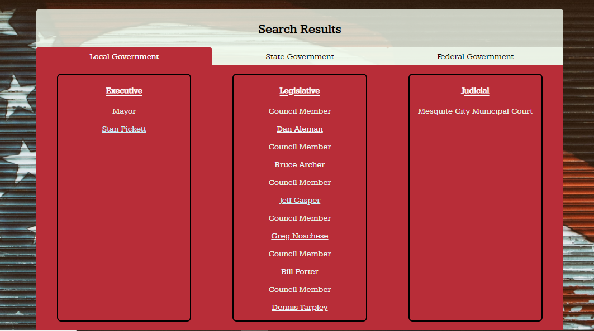

# representatives-app

<h1>representatives-app</h1>

<h2>Who are your representatives in the USA?</h2>

<a id="representatives-app" href="https://laradei.github.io/representatives-app/">https://laradei.github.io/representatives-app/</a>
 
<h3>Summary</h3>

This app accepts your address and returns your U.S. representatives at the local, state, and federal level 

I've used <a href="https://votesmart.org/share/api#.X3vnxmhKiM9">The Vote Smart API</a>

Search form:

please match the address format given in the placeholders

Results:

The data at vote smart has some holes, and you might not get local government data if you live in a small town

<h3>Technology Used</h3>

HTML/CSS/JavaScript/jQuery

<h3>The API hack capstone assignment</h3>

The app should do something interesting: The overarching UX (user experience) requirement for this app is that it pulls in data from third party APIs and displays that data in some way to your user. It's up to you to figure out how to make this experience feel compelling to the user, and who it is that you want to make something interesting for. If you choose to work with only 1 API, you must do something with the data to present it in an original or interesting way.

Polished appearance for final version: Initially, you'll implement a minimal, functional prototype of your app, which you'll use to get feedback on your app's features. While the first version should not be polished, the final version you submit should be. We'll go into greater detail about what this means in the checkpoint dedicated to styling your app.

Refer to this design checklist for help.

Responsive: The final version of your app should work on both mobile and desktop.

Refer back to your responsiveness checklist for help.

Accessibility: The final version of your app must follow a11y best practices.

